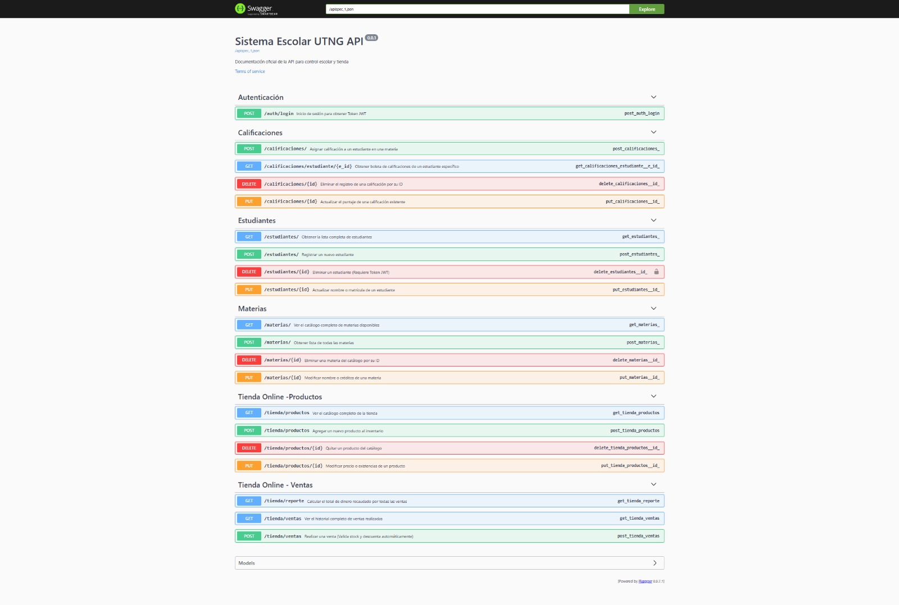

# 🏫 Sistema Integral de Gestión Escolar y E-commerce API (UTNG)

## 📌 Descripción del Proyecto
Este proyecto consiste en el desarrollo de una **API RESTful** robusta diseñada para centralizar las operaciones académicas y comerciales de una institución educativa. La arquitectura permite la gestión eficiente de expedientes estudiantiles, el control de historial académico y la operación de una tienda en línea con lógica de inventarios en tiempo real.

Desarrollado como proyecto integrador para la carrera de **Desarrollo de Software Multiplataforma** en la **UTNG**.

---

## 🛠️ Stack Tecnológico
* **Lenguaje**: Python 3.10+
* **Framework**: Flask (Micro-framework)
* **ORM**: SQLAlchemy para la abstracción de base de datos
* **Base de Datos**: PostgreSQL
* **Seguridad**: Autenticación basada en JSON Web Tokens (JWT)
* **Documentación**: OpenAPI 3.0 / Swagger (Flasgger)

---




## 📂 Estructura del Proyecto
Basado en una arquitectura modular para facilitar el escalamiento y mantenimiento del código:

```text
MI_API/
├── app/                    # Núcleo de la aplicación
│   ├── models/             # Definición de tablas (SQLAlchemy)
│   │   ├── calificacion.py
│   │   ├── estudiante.py
│   │   ├── materia.py
│   │   ├── tienda.py
│   │   └── usuario.py
│   ├── routes/             # Controladores y Endpoints (Blueprints)
│   │   ├── auth.py         # Login y seguridad JWT
│   │   ├── calificaciones.py
│   │   ├── estudiantes.py
│   │   ├── materias.py
│   │   └── tienda.py       # Lógica de ventas e inventario
│   ├── config.py           # Configuración de variables de entorno
│   └── __init__.py         # Inicialización de la App
├── db/                     # Almacenamiento de base de datos
│   └── respaldo.utng.sql   # Backup para restauración en pgAdmin
├── postman/                # Documentación de pruebas
│   └── peticiones.txt      # Comandos cURL de evidencia
├── .env                    # Variables sensibles (Base de datos/Keys)
├── .gitignore              # Archivos excluidos de Git
├── requirements.txt        # Dependencias del sistema
└── run.py                  # Punto de entrada del servidor
```


## 🚀 Módulos del Sistema

### 1. Gestión Académica (CRUD)
* **Estudiantes**: Registro, consulta, edición y baja de alumnos.
* **Materias**: Catálogo oficial de asignaturas escolares.
* **Calificaciones**: Asignación de puntajes vinculados a estudiantes y materias específicas.

### 2. Tienda Online (E-commerce)
* **Inventario**: Control de productos con atributos de nombre, precio y stock.
* **Ventas Inteligentes**: Endpoint de ventas con validación de integridad (descuento automático de existencias).
* **Prevención de Errores**: El sistema impide ventas si la cantidad solicitada supera el stock disponible.
* **Reportes Financieros**: Cálculo automatizado de ingresos totales acumulados.

### 3. Seguridad y Acceso
* **Autenticación**: Sistema de Login que genera un token de acceso seguro.
* **Protección de Rutas**: Los métodos sensibles (como DELETE o PUT) requieren el encabezado `Authorization: Bearer <token>`.

---

## 📂 Organización del Repositorio
Para facilitar la revisión, el proyecto incluye recursos adicionales en las siguientes rutas:
* `/app/models`: Definición de la estructura de las tablas de base de datos.
* `/app/routes`: Lógica de los Blueprints y controladores de la API.
* `/db`: Backup oficial de la base de datos `respaldo_utng.sql` listo para restaurar en pgAdmin.
* `/postman`: Archivo `peticiones.txt` con ejemplos de peticiones cURL para pruebas rápidas de todos los métodos.

---

## ⚙️ Guía de Despliegue Local

1. **Entorno Virtual**:
   ```bash
   python -m venv .venv
   source .venv/bin/activate  # En Windows: .venv\Scripts\activate
